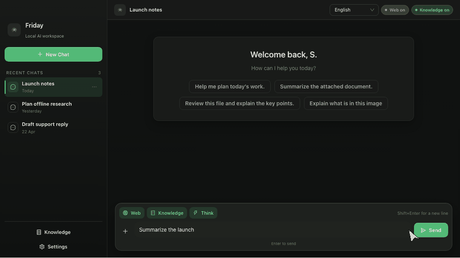

# Friday

Friday is a your personal local AI assistant which runs efficienltly even in a 8GB Macbook Air. Private by design so works 100% offline. No subscriptions, No ratelimits.



## Why Friday

- Zero Setup needed. Install and get started right away.
- Local-first by default: chats, prompts, settings, and attached files stay on-device.
- Supports toolcalling including web search and custom knowledgebase out of the box.
- Practical multimodality: text/code files, PDFs, DOCX, images, and audio can all be attached in the main chat flow.
- Runs Google Gemma models using Google's own llm runtime engine natively for superfast performance.

## Platform Support

Friday currently supports **macOS on Apple Silicon (M-series) only**.

Support for other platforms may be added in future releases.

## Stack

- Tauri
- LiteRT-LM Runtime
- Google's Gemma Models
- SearXNG for Web Search
- embed_anything
- Lance DB vector storage

## Model Registry

The app ships a small built-in model registry in [`src-tauri/src/sidecar.rs`](src-tauri/src/sidecar.rs).

| Model | Download | Minimum Recommended RAM | Context | Recommended Output | Capabilities |
| --- | ---: | ---: | ---: | ---: | --- |
| `Gemma 4 E2B` | ~2.41 GB | 4 GB | 131,072 | 4,096 | text, image, audio, thinking |
| `Gemma 4 E4B` | ~3.40 GB | 8 GB | 131,072 | 8,192 | text, image, audio, thinking |

Friday defaults to `Gemma 4 E2B` on most systems and to `Gemma 4 E4B` when total RAM is above `16 GB`.

## Getting Started

### Prerequisites

For local development you need:

- Node.js `24.1.0` from [`.nvmrc`](.nvmrc) or a compatible version
- npm
- Rust toolchain
- Tauri 2 system prerequisites for your OS
- macOS Apple Silicon

Friday does not require a separately installed system Python runtime for the shipped app flow.

### Install Dependencies

```bash
npm install
```

### Run In Development

```bash
npm run tauri dev
```

### Build

Build the frontend bundle:

```bash
npm run build
```

Build the desktop app:

```bash
npm run tauri build
```

### Test And Check

```bash
npm run typecheck
cargo check --manifest-path src-tauri/Cargo.toml
cargo test --manifest-path src-tauri/Cargo.toml
npm run cargo:clippy
npm run check
```

`npm run check` is the default local validation flow. CI and release workflows additionally run `npm run cargo:clippy`.


## Features

- Setup wizard with user display-name capture
- Session sidebar with create/select/delete flows
- Automatic chat title updates after the first user message
- Drawer-based session navigation on narrow layouts
- Streaming chat pane with assistant answer and thought streaming
- Drag-and-drop and file-picker attachment flow
- Audio recording button when microphone capture is available
- Reply language selector
- Web search toggle
- Thinking toggle
- Markdown answers with code-copy controls and KaTeX math
- Collapsible reasoning panel when a reply includes thinking content
- Connection/privacy status pills and inline tool-activity status text
- Settings drawer for token budget, theme selection, and model switching/downloads

## Project Layout

```text
daksha-ai/
├── README.md
├── AGENTS.md
├── package.json
├── vite.config.ts
├── .github/
│   └── workflows/
├── src/
│   ├── App.tsx
│   ├── main.tsx
│   ├── styles.css
│   ├── components/
│   ├── hooks/
│   ├── theme/
│   └── types.ts
└── src-tauri/
    ├── build.rs
    ├── Cargo.toml
    ├── tauri.conf.json
    ├── migrations/
    ├── python_tests/
    ├── resources/
    └── src/
```

## Release Workflow

The repo uses a tag-driven macOS release workflow in [`.github/workflows/release.yml`](.github/workflows/release.yml).

Current release behavior:

- any pushed tag triggers the release workflow
- the workflow builds and uploads the macOS Apple Silicon app assets to the GitHub release for that tag
- GitHub release notes are generated automatically
- tags containing `-` are marked as prereleases (for example: `v0.2.0-rc.1`)
- releases can fall back to ad-hoc signing when Apple signing secrets are missing
- Apple Silicon is the supported packaging target today because `src-tauri/build.rs` only vendors the managed runtime for `macos/aarch64`

Accepted tag formats:

- `v0.2.0`
- `0.2.0`

## Contributing

- Create a new separate branch and only add PR's for the dev branch.
- Use `npm run tauri dev` and `npm run tauri build` so the frontend hooks defined in `src-tauri/tauri.conf.json` stay in sync.
- There is no root `Cargo.toml`; use `--manifest-path src-tauri/Cargo.toml`.
- When changing a Tauri command or payload, update both Rust handlers and the matching TypeScript types in [`src/types.ts`](src/types.ts).
- Model/runtime changes usually span `src-tauri/build.rs`, `src-tauri/src/sidecar.rs`, `src-tauri/src/python_runtime.rs`, and the bundled resource tree under `src-tauri/resources/`.

## License

[License](./License.md)
